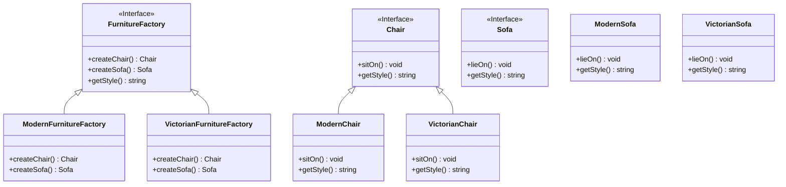
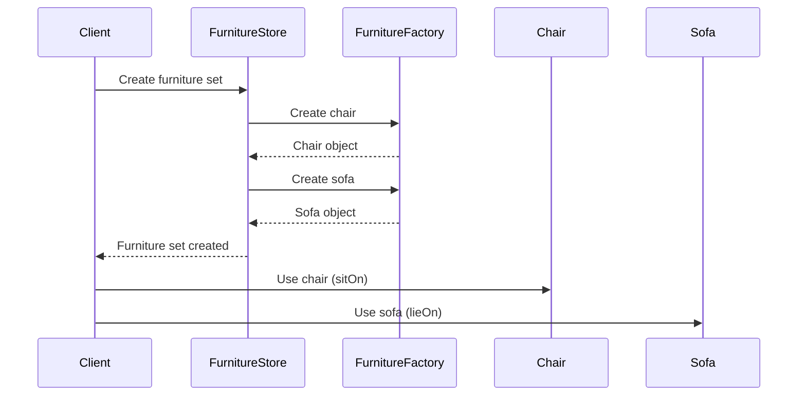

# Abstract Factory Pattern Implementation: Furniture Store

## Overview

This implementation demonstrates the Abstract Factory pattern using a furniture store example. The pattern allows creating families of related objects without specifying their concrete classes. In this case, we create different styles of furniture (Modern and Victorian) while maintaining consistent style across product families.


## Components

### Interfaces

1. **FurnitureFactory**: The abstract factory interface that declares methods for creating furniture.
    - `createChair()`: Creates a chair of the specific style
    - `createSofa()`: Creates a sofa of the specific style
    - `getStyle()`: Returns the style name

2. **Chair**: Interface for all chair products
    - `sitOn()`: Simulates sitting on the chair
    - `getStyle()`: Returns the chair's style

3. **Sofa**: Interface for all sofa products
    - `lieOn()`: Simulates lying on the sofa
    - `getStyle()`: Returns the sofa's style

### Concrete Classes

1. **Modern Style Implementation**
    - `ModernFurnitureFactory`: Creates modern style furniture
    - `ModernChair`: Implements modern chair behavior
    - `ModernSofa`: Implements modern sofa behavior

2. **Victorian Style Implementation**
    - `VictorianFurnitureFactory`: Creates Victorian style furniture
    - `VictorianChair`: Implements Victorian chair behavior
    - `VictorianSofa`: Implements Victorian sofa behavior

### Class Relationships



## Usage Example

### Sequence diagram



### Code Example

```java
// Create a modern furniture store
FurnitureStore modernStore = new FurnitureStore(new ModernFurnitureFactory());
modernStore.orderFurnitureSet();

// Create a Victorian furniture store
FurnitureStore victorianStore = new FurnitureStore(new VictorianFurnitureFactory());
victorianStore.orderFurnitureSet();
```

## Key Benefits

1. **Consistent Product Families**: Ensures that furniture pieces match in style
2. **Encapsulation**: Hides the concrete classes from the client code
3. **Easy Extension**: New styles can be added by implementing new factories and products
4. **Single Responsibility**: Each factory is responsible for creating one style of furniture

## Testing

The implementation includes comprehensive unit tests that verify:
- Correct creation of furniture by each factory
- Proper style assignment for all furniture pieces
- Appropriate behavior of furniture items
- Correct handling of furniture orders by the store