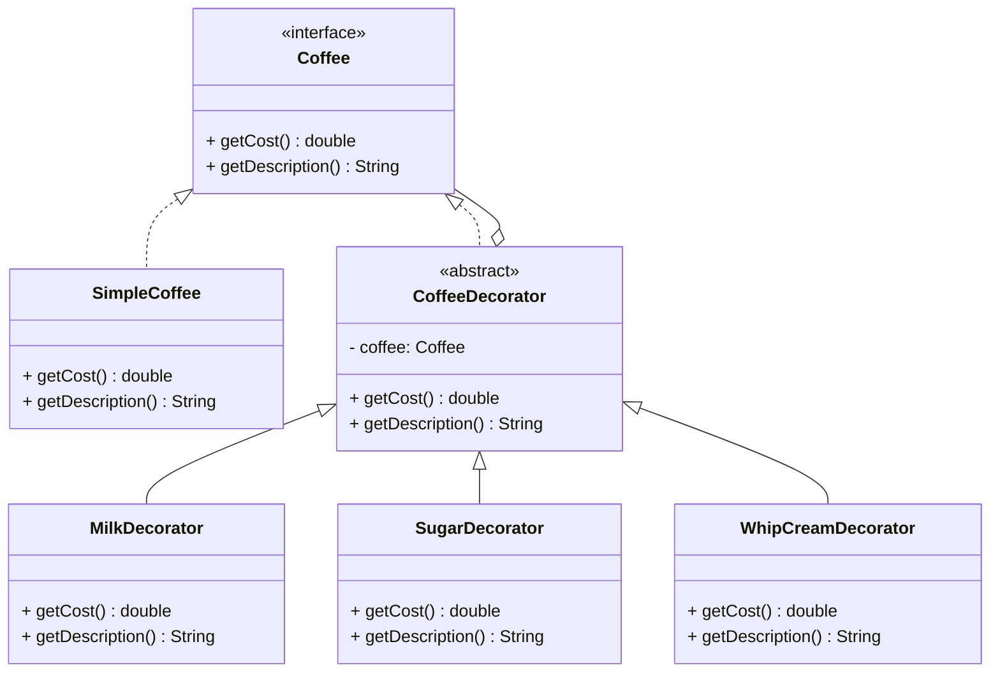
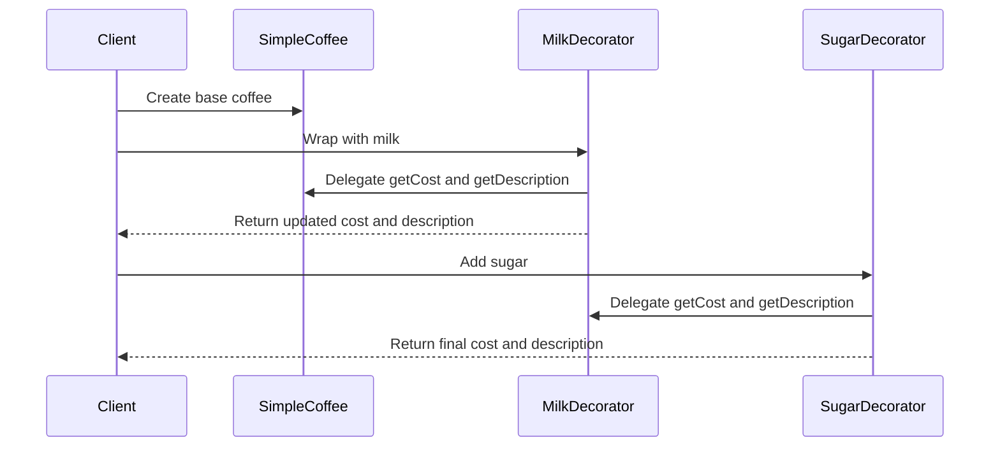

# Decorator Pattern Implementation Guide

## Overview

The Decorator pattern provides a flexible alternative to subclassing for extending functionality. It lets you attach additional responsibilities to objects dynamically by placing these objects inside wrapper objects that contain the behaviors. Our implementation demonstrates this pattern through a coffee ordering system, where different ingredients can be added to a base coffee dynamically.

## Implementation Structure

### Core Components

The implementation consists of four main parts:

1. The Component Interface (`Coffee`): Defines the interface for objects that can have responsibilities added to them.

```java  
public interface Coffee {
    
    double getCost();
    
    String getDescription();
}  
```  

2. Concrete Component (`SimpleCoffee`): Defines an object to which additional responsibilities can be attached.

3. Abstract Decorator (`CoffeeDecorator`): Maintains a reference to a Component object and defines an interface that conforms to Component's interface.

4. Concrete Decorators (`MilkDecorator`, `SugarDecorator`, `WhipCreamDecorator`): Add responsibilities to the component.

### Class Relationships



## Usage Example

The pattern allows for dynamic composition of behaviors. Here's a sequence showing how different coffee combinations are created:



### Code Example

```java  
// Create a basic coffee  
Coffee coffee = new SimpleCoffee();  
System.out.println(coffee.getDescription() + " - $" + coffee.getCost());  
  
// Add milk  
coffee = new MilkDecorator(coffee);  
System.out.println(coffee.getDescription() + " - $" + coffee.getCost());  
  
// Add sugar  
coffee = new SugarDecorator(coffee);  
System.out.println(coffee.getDescription() + " - $" + coffee.getCost());  
```  

## Key Benefits

1. **Flexibility**: The pattern provides a more flexible way to extend functionality compared to inheritance. New behaviors can be added by creating new decorator classes without modifying existing code.

2. **Dynamic Composition**: Responsibilities can be added or removed at runtime, allowing for dynamic behavior modification.

3. **Single Responsibility Principle**: Each decorator class handles one specific additional responsibility, making the code easier to maintain and understand.

4. **Open/Closed Principle**: New functionalities can be added without modifying existing code, simply by creating new decorator classes.

## Implementation Considerations

### When to Use

The Decorator pattern is particularly useful when:

1. You need to add responsibilities to objects dynamically and transparently.
2. Extension by subclassing is impractical or impossible.
3. You want to avoid a class hierarchy explosion.
4. You need to maintain single responsibility principle while adding features.

### Testing Approach

The implementation includes comprehensive tests covering:

1. Basic functionality of concrete components
2. Individual decorator behavior
3. Combined decorator scenarios
4. Edge cases and error handling

Example test structure:

```java  
@Test  
void shouldCombineDecoratorsCorrectly() {  
    Coffee coffee = new WhipCreamDecorator(                    new SugarDecorator(                        new MilkDecorator(new SimpleCoffee())));        assertEquals(9.0, coffee.getCost());  
    assertEquals("Simple Coffee, Milk, Sugar, Whip Cream",                 coffee.getDescription());  
}  
```  

## Best Practices

1. Keep decorators lightweight and focused on a single responsibility.
2. Ensure consistent interface implementation across all decorators.
3. Consider using dependency injection for complex decorator scenarios.
4. Document the expected order of decorators if it affects the outcome.
5. Handle null values and edge cases appropriately in decorator constructors.

## Maintenance and Extension

To add new functionality:

1. Create a new decorator class extending `CoffeeDecorator`
2. Implement the required methods (getCost, getDescription)
3. Add appropriate unit tests for the new decorator
4. Update documentation to reflect new capabilities

Example of adding a new decorator:

```java  
public class CaramelDecorator extends CoffeeDecorator {  
    public CaramelDecorator(Coffee coffee) {        
        super(coffee);    
    }  
    @Override    
    public double getCost() {
        return coffee.getCost() + 1.0;    
    }  
    
    @Override    
    public String getDescription() {        
        return coffee.getDescription() + ", Caramel";    
    }
}  
```