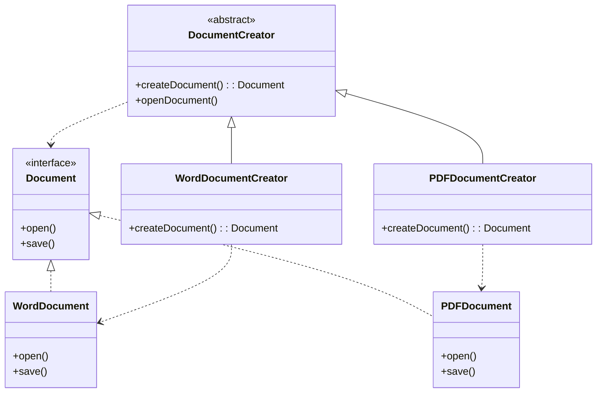
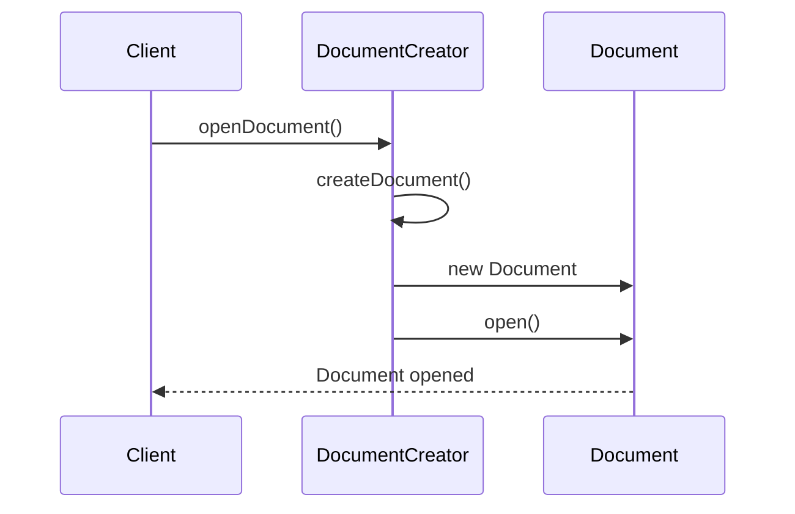

# **Factory Method Pattern Implementation**

## **Overview**

The Factory Method Pattern is a creational design pattern that provides an interface for creating objects but allows subclasses to alter the type of objects that will be created. This implementation demonstrates a document creation system where different types of documents (Word, PDF) can be created without exposing the instantiation logic to the client.
  
---  

## **Core Components**

1. **Product Interface (`Document`)**:
    - Defines the interface for objects created by the factory
    - Methods:
        - `open()`: Opens the document
        - `save()`: Saves the document

2. **Concrete Products**:
    - `WordDocument`: Implementation for Word documents
    - `PDFDocument`: Implementation for PDF documents

3. **Creator (`DocumentCreator`)**:
    - Abstract class defining the factory method
    - Methods:
        - `createDocument()`: Abstract factory method
        - `openDocument()`: Template method using the factory method

4. **Concrete Creators**:
    - `WordDocumentCreator`: Creates Word documents
    - `PDFDocumentCreator`: Creates PDF documents

---  

## **Class Diagram**


  
---  

## **Sequence Diagram**


  
---  

## **Usage Example**

```java  
public class Main {
    public static void main(String[] args) {
        DocumentCreator wordCreator = new WordDocumentCreator();
        DocumentCreator pdfCreator = new PDFDocumentCreator();

        // Create and open a Word document
        wordCreator.openDocument();

        // Create and open a PDF document
        pdfCreator.openDocument();
    }
}
```  
  
---  

## **Benefits**

1. **Encapsulation**:
    - Document creation logic is encapsulated in creator classes
    - Client code is decoupled from concrete document classes

2. **Flexibility**:
    - Easy to add new document types without changing existing code
    - Supports the Open/Closed Principle

3. **Consistency**:
    - Enforces consistency in document creation through the factory method
    - Provides a standard interface for creating documents

4. **Maintainability**:
    - Centralized document creation logic
    - Clear separation of concerns

---  

## **Testing**

The implementation includes comprehensive unit tests that verify:

1. Creation and opening of Word documents
2. Creation and opening of PDF documents
3. Saving functionality for both document types
4. Proper implementation of factory methods

---  

## **Considerations**

- This implementation prioritizes clarity and simplicity
- Each creator is responsible for creating a single type of document
- The pattern can be extended to support additional document types
- The template method (`openDocument`) demonstrates typical factory method usage