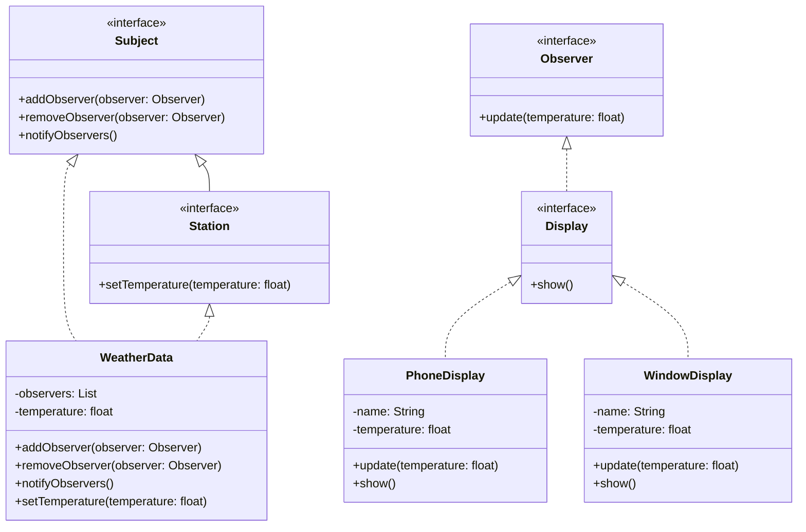
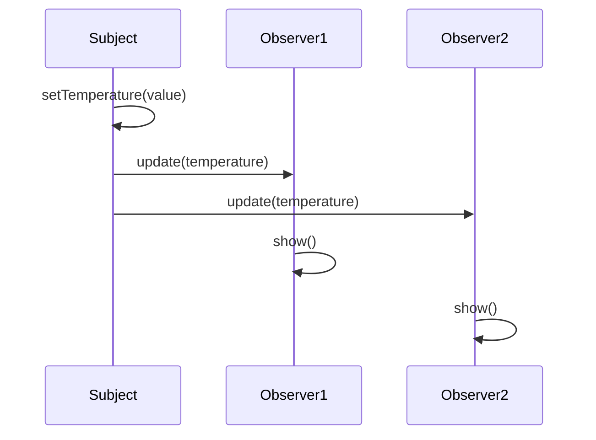

# **Observer Pattern Implementation**

## **Overview**

The Observer pattern is a behavioral design pattern that establishes a **one-to-many relationship** between objects. When one object (the subject) changes its state, all its dependents (observers) are notified and updated automatically.

This implementation demonstrates a **weather monitoring system** where multiple displays (observers) update whenever the temperature changes in the weather station (subject).

---

## **Core Components**

1. **Subject Interface**:

    - Defines methods for managing observers:
        - `addObserver(Observer observer)`: Registers a new observer.
        - `removeObserver(Observer observer)`: Unregisters an observer.
        - `notifyObservers()`: Notifies all observers of state changes.
2. **Observer Interface**:

    - Defines the method that observers must implement:
        - `update(float temperature)`: Receives updates when the subject's state changes.
3. **Domain-Specific Interfaces**:

    - **`Station`**: Extends the Subject interface with weather-specific functionality.
        - `setTemperature(float temperature)`: Updates the station's temperature.
    - **`Display`**: Extends the Observer interface to display specific functionality.
        - `show()`: Displays the current state (e.g., temperature).
4. **Concrete Classes**:

    - **`WeatherData`**: Implements the `Station` interface to manage temperature data and observers.
    - **`PhoneDisplay`**: Implements the `Display` interface for mobile devices.
    - **`WindowDisplay`**: Implements the `Display` interface for larger, fixed-location displays.

---

## **Class Diagram**



---

## **Sequence Diagram**



---

## **Usage Example**

Here’s how the Observer pattern is used in the weather monitoring system:

```java
// Create the weather station
Station weatherStation = new WeatherData();

// Create displays
Display phoneDisplay = new PhoneDisplay("Phone");
Display windowDisplay = new WindowDisplay("Window");

// Register observers
weatherStation.addObserver(phoneDisplay);
weatherStation.addObserver(windowDisplay);

// Update temperature - all displays will be notified
weatherStation.setTemperature(25.0f);

// Remove an observer
weatherStation.removeObserver(windowDisplay);

// Update temperature again - only phone display will be notified
weatherStation.setTemperature(30.0f);
```

---

## **Benefits**

- **Loose Coupling**:
    - Subjects and observers are decoupled, allowing them to evolve independently.
- **Dynamic Relationships**:
    - Observers can be added or removed at runtime without modifying the subject.
- **Broadcast Communication**:
    - One-to-many dependency ensures all observers receive updates simultaneously.
- **Automatic Updates**:
    - Observers are notified automatically when the subject’s state changes.

---

## **Testing**

This implementation includes unit tests to verify:

1. Notifications to all observers when the temperature changes.
2. Correct handling of observer removal.
3. Proper behavior for multiple temperature updates.
4. Handling of duplicate observer registrations.
5. Validation of output for different display types.

---

## **Considerations**

- This implementation prioritizes clarity and simplicity.
- Each observer handles its own update logic independently.
- Adding new types of displays is straightforward and requires minimal changes.
- The pattern supports dynamic observer management at runtime.
