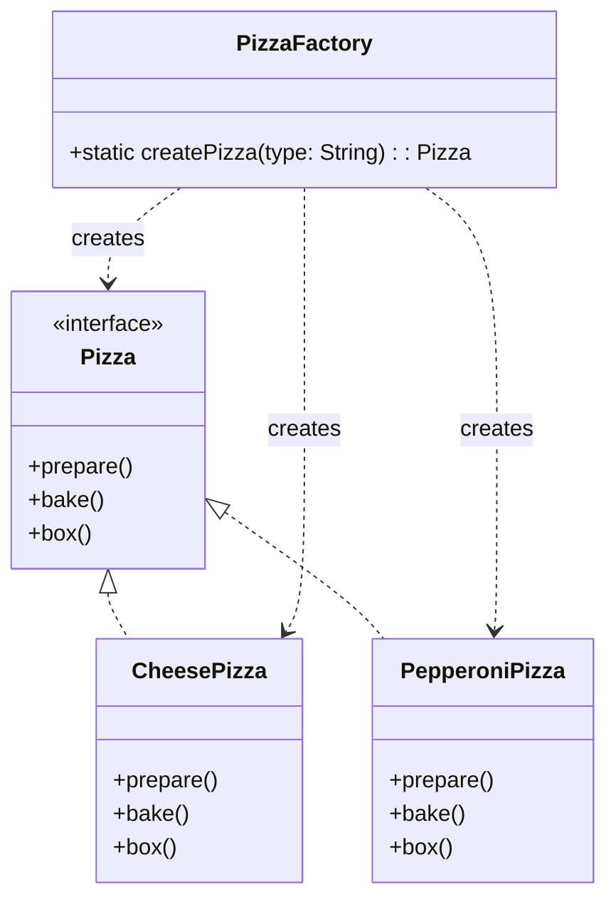
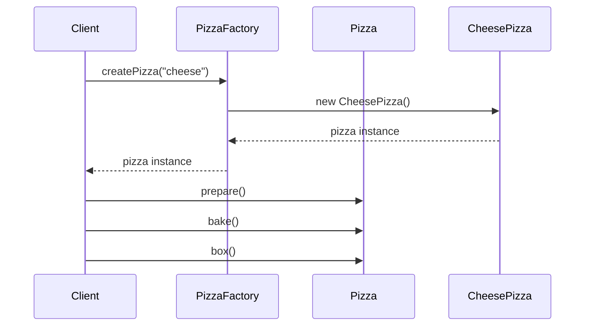

# **Simple Factory Pattern Implementation**

## **Overview**

The Simple Factory is a basic creational pattern that provides a static method for creating objects of a specific type. While not a formal design pattern from the Gang of Four, it's a commonly used idiom that encapsulates object creation logic and provides a single point of entry for object creation.

This implementation demonstrates a pizza store system where different types of pizzas are created through a centralized factory.

---

## **Core Components**

1. **Product Interface (`Pizza`)**:
   - Defines the interface that all concrete products must implement
   - Declares methods: `prepare()`, `bake()`, and `box()`

2. **Concrete Products**:
   - `CheesePizza`: Implementation for cheese pizza
   - `PepperoniPizza`: Implementation for pepperoni pizza

3. **Factory (`PizzaFactory`)**:
   - Static factory method `createPizza(String type)`
   - Encapsulates object creation logic
   - Returns appropriate pizza instance based on type parameter

---

## **Class Diagram**



---

## **Sequence Diagram**



---

## **Usage Example**

```java
// Create a cheese pizza
Pizza cheesePizza = PizzaFactory.createPizza("cheese");
cheesePizza.prepare();
cheesePizza.bake();
cheesePizza.box();

// Create a pepperoni pizza
Pizza pepperoniPizza = PizzaFactory.createPizza("pepperoni");
pepperoniPizza.prepare();
pepperoniPizza.bake();
pepperoniPizza.box();
```

Example Output:
```
Preparing cheese pizza...
Baking cheese pizza...
Boxing cheese pizza...

Preparing pepperoni pizza...
Baking pepperoni pizza...
Boxing pepperoni pizza...
```

---

## **Benefits**

1. **Encapsulation**:
   - Object creation logic is centralized in one place
   - Changes to creation process only affect factory class

2. **Single Responsibility**:
   - Factory handles only object creation
   - Products handle only their specific behaviors

3. **Flexibility**:
   - Easy to add new product types
   - Client code is decoupled from concrete classes

4. **Maintainability**:
   - Creation logic is centralized and easier to maintain
   - Changes to creation process don't affect client code

---

## **Limitations**

1. **Limited Flexibility**:
   - Factory is tied to specific product types
   - Cannot easily change product families

2. **Complexity**:
   - Adds another layer to the codebase
   - May be overkill for simple object creation

---

## **Testing**

The implementation includes comprehensive tests that verify:

1. Creation of different pizza types
2. Proper handling of invalid pizza types
3. Case-insensitive type handling
4. Proper execution of pizza preparation steps

---

## **Considerations**

- This implementation prioritizes simplicity and clarity
- Error handling is implemented through exceptions
- Product types are identified using strings (could be enhanced with enums)
- Factory method is static for simplicity (could be instance-based if needed)

---

## **Related Patterns**

- **Factory Method**: More flexible pattern where subclasses decide which class to instantiate
- **Abstract Factory**: Creates families of related objects
- **Builder**: When object creation is complex and requires multiple steps