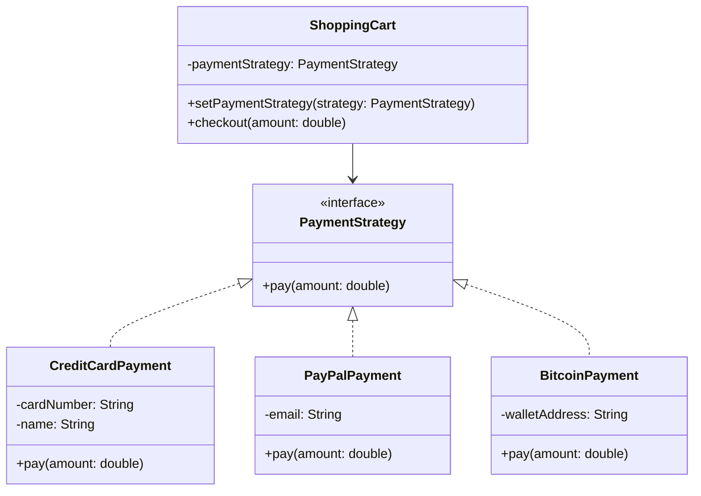
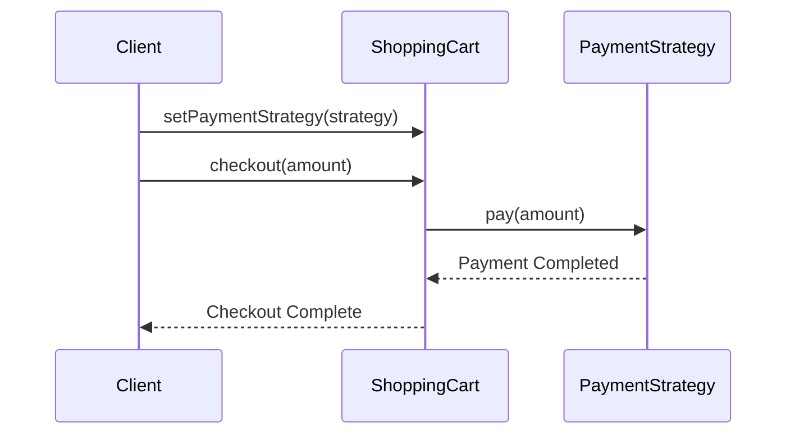

# **Strategy Pattern Implementation**

## **Overview**

The Strategy pattern is a behavioral design pattern that allows you to select an algorithm’s implementation at runtime. It encapsulates a family of algorithms, defines a common interface for them, and makes them interchangeable within a context object.

This implementation demonstrates a shopping cart payment system that supports multiple payment methods.

---

## **Core Components**

1. **Strategy Interface (`PaymentStrategy`)**:

   - A common interface for all payment strategies:
      - `pay(double amount)`: Executes the payment using the selected strategy.
2. **Context (`ShoppingCart`)**:

   - Maintains a reference to the current payment strategy and delegates payment processing:
      - `setPaymentStrategy(PaymentStrategy strategy)`: Changes the payment method.
      - `checkout(double amount)`: Processes the payment with the chosen strategy.
3. **Concrete Strategies**:

   - **`CreditCardPayment`**: Processes payments using credit card details.
   - **`PayPalPayment`**: Handles transactions through PayPal.
   - **`BitcoinPayment`**: Manages payments using Bitcoin wallets.

---

## **Class Diagram**



---

## **Sequence Diagram**



---

## **Usage Example**

Here’s how the Strategy pattern is applied in the payment system:

```java
ShoppingCart cart = new ShoppingCart();

// Pay with Credit Card
cart.setPaymentStrategy(new CreditCardPayment("1234-5678-9012-3456", "John Doe"));
cart.checkout(100.0);

// Switch to PayPal
cart.setPaymentStrategy(new PayPalPayment("john.doe@example.com"));
cart.checkout(150.0);

// Switch to Bitcoin
cart.setPaymentStrategy(new BitcoinPayment("1A2b3C4d5E6f7G8h9I0J"));
cart.checkout(200.0);
```

---

## **Benefits**

- **Flexibility**: Algorithms (payment methods) can be switched at runtime.
- **Modularity**: Each strategy implementation is isolated and maintainable.
- **Extensibility**: New payment methods can be added without modifying existing code.
- **Readability**: Avoids complex conditional statements for handling different payment methods.

---

## **Testing**

This implementation includes unit tests to verify:

1. Payment processing for each strategy.
2. Proper handling when no payment strategy is set.
3. Switching between payment strategies.
4. Output validation for each payment method.

---

## **Considerations**

- This implementation prioritizes simplicity and clarity.
- Each payment strategy is responsible for its own logic.
- Adding new payment methods is straightforward and does not disrupt existing functionality.
- Error handling is minimal to focus on the Strategy pattern’s principles.

